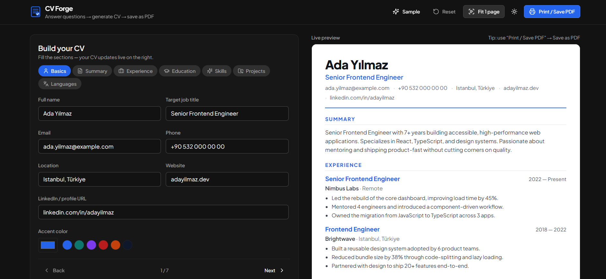
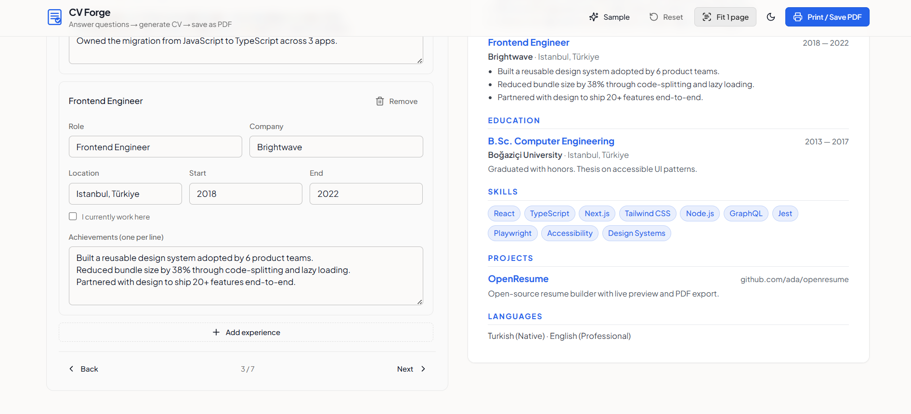

# CV Forge 📄🔨

> A modern, lightning-fast, and accessible resume builder that generates professional, single-page PDF resumes directly from the browser.
## TO TRY IT 
**Live Demo:** [Click here to build your CV](https://cv-forge-weld.vercel.app/#/)




## 🚀 Overview

CV Forge is a client-side web application designed to simplify the resume creation process. It features a real-time live preview, smart auto-suggestions, and a highly optimized print-to-PDF layout engine. 

Currently, the application runs entirely in the browser, ensuring 100% data privacy for users.

## ✨ Key Features

*   **Real-time Live Preview:** Watch your resume update instantly as you type.
*   **Smart Print Engine:** Custom CSS and JavaScript event listeners (`beforeprint`/`afterprint`) to dynamically scale the UI, ensuring the generated PDF fits perfectly on a single A4 page without layout breakage.
*   **Smart Summary Generator:** Automatically suggests a professional summary based on the provided job title and skills.
*   **Sample Data Injection:** One-click sample data loading to instantly understand the layout and capabilities.
*   **Theming:** Built-in Dark/Light mode toggle.
*   **Privacy-First:** Zero data upload. Everything is processed and kept in the browser.

## 🛠️ Tech Stack

*   **Frontend Framework:** React 18, Vite
*   **Styling:** Tailwind CSS
*   **UI Components:** Radix UI (Primitives for accessibility)
*   **Icons:** Lucide React
*   **State Management:** Custom Hooks (React State)

## 🗺️ Future Roadmap (Full-Stack Evolution)

As part of the continuous improvement of this product, the next major release will transition CV Forge from a client-side tool into a Full-Stack application:

- [ ] **RESTful API:** Building a robust backend service using **C# (.NET Core)**.
- [ ] **Database Integration:** Utilizing **SQL Server** for structured data storage.
- [ ] **Authentication:** Implementing secure user login (JWT) to allow users to save, manage, and edit multiple resumes across different devices.
- [ ] **State Persistence:** Integrating `localStorage` as an interim solution before the API deployment.

## 📦 Local Development

To run this project locally on your machine:

1.  **Clone the repository:**
    ```bash
    git clone [https://github.com/muhammedham/cv-forge.git](https://github.com/muhammedham/cv-forge.git)
    ```

2.  **Install dependencies:**
    ```bash
    cd cv-forge
    npm install
    ```

3.  **Start the development server:**
    ```bash
    npm run dev
    ```

4.  **Open in your browser:**
    Navigate to `http://localhost:5173`

---
*Built by [Muhammed Hamadin](https://github.com/muhammedham)*
